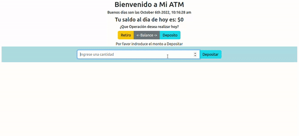

<div align="center" id="top"> 
  

  &#xa0;

  <!-- <a href="https://mitmern2022.netlify.app">Demo</a> -->
</div>

<h1 align="center">My ATM</h1>

<p align="center">
  

  

  

  

  <!--  -->

  <!--  -->

  <!--  -->
</p>

<!-- Status -->

<!-- <h4 align="center"> 
	🚧  MIT MERN 2022 🚀 Under construction...  🚧
</h4> 

<hr> -->

<p align="center">
  <a href="#dart-about">About</a> &#xa0; | &#xa0; 
  <a href="#sparkles-features">Features</a> &#xa0; | &#xa0;
  <a href="#rocket-technologies">Technologies</a> &#xa0; | &#xa0;
  <a href="#white_check_mark-requirements">Requirements</a> &#xa0; | &#xa0;
  <a href="#checkered_flag-starting">Starting</a> &#xa0; | &#xa0;
  <a href="#memo-license">License</a> &#xa0; | &#xa0;
  <a href="https://github.com/jlpm-mex" target="_blank">Author</a>
</p>

<br>

## :dart: About ##

Ejercicio de la semana 15 del Mit full stack developer, donde se ponen en práctica los conocimientos de react aprendidos, la idea base era replicar el comportamiento de un cajero. Yo tome esa idea y le agregue mi toque personal permitiendo que el usuario identifique de una forma más clara cuando esta haciendo un retiro o un depósito y agregando una sección de balance donde es posible ver el historial de depósitos y retiros.

## :sparkles: Features ##

:heavy_check_mark: Depositos ilimitados;\
:heavy_check_mark: Sobregiros de la cuenta protegidos;\
:heavy_check_mark: Balance de las operaciones realizadas;

## :rocket: Technologies ##

The following tools were used in this project:

- [Node.js](https://nodejs.org/en/)
- [React](https://pt-br.reactjs.org/)
- [JavaScript](https://developer.mozilla.org/en-US/docs/Web/JavaScript)

## :white_check_mark: Requirements ##

Before starting :checkered_flag:, you need to have [Git](https://git-scm.com), [Node](https://nodejs.org/en/) and [http-server](https://www.npmjs.com/package/http-server) installed.

## :checkered_flag: Starting ##

```bash
# Clone this project
$ git clone https://github.com/jlpm-mex/MyATM

# Access
$ cd MyATM

# Run the project
$ http-server -p8080

# The server will initialize in the <http://localhost:8080>
```

## :memo: License ##

This project is under license from MIT. For more details, see the [LICENSE](LICENSE.md) file.


Made with :heart: by <a href="https://github.com/jlpm-mex" target="_blank">Jose Luis Pino</a>

&#xa0;

<a href="#top">Back to top</a>
